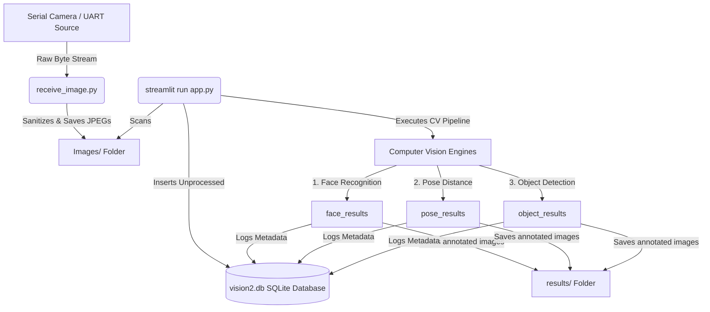

# Walkthrough: Face & Object Distance Demo Application

This document provides step-by-step instructions on how to run, configure, and manage the Face Recognition, Pose Distance, and Object Detection demo application.

---

## 🏗️ System Architecture & Workflow

The application operates as a decoupled, real-time image processing pipeline:



1. **Image Acquisition (`receive_image.py`)**: Runs in the workspace root, reads byte stream from a serial port (UART), extracts complete JPEG frames, sanitizes stream noise/overlap, and saves them to the root `Images/` folder.
2. **Vision Dashboard (`face_dist_obj_demo_app/app.py`)**: A Streamlit dashboard that monitors `../Images/` for new frames, inserts them into an SQLite database (`vision2.db`), and passes them through face, pose, and object pipelines, storing predictions/annotated images in SQLite and the `results/` folder.

---

## 📂 Project Directory Structure

```
eAge_AI_Applications/
│
├── receive_image.py            # Serial receiver script (runs in root)
├── Images/                     # Incoming raw images folder (created dynamically)
│
└── face_dist_obj_demo_app/     # Main processing application folder
    ├── app.py                  # Streamlit dashboard & pipeline orchestrator
    ├── requirements.txt        # Application package dependencies
    ├── reset_db.py             # Helper to clear/initialize SQLite database tables
    ├── serial_camera.py        # Alternative receiver script
    ├── vision2.db              # Active SQLite database
    ├── db/                     # DB utilities package
    │   └── db.py               # Database schemas & operations
    ├── pipelines/              # ML inference modules
    │   ├── face_recognition.py # MTCNN/FaceNet pipeline
    │   ├── pose_distance.py    # MediaPipe pose estimation & depth modeling
    │   └── object_detection.py # YOLO-based object detection engine
    ├── models/                 # Model files and weights storage
    └── results/                # Outputs containing annotated images
        ├── face/               # Recognized face images
        ├── distance/           # Pose distance marked images
        └── object/             # Object detection labeled images
```

---

## 🚀 Setup & Execution Guide

Follow these steps in sequence to run the demo.

### 📋 Prerequisites & Installation

Open your terminal, navigate to the `face_dist_obj_demo_app` directory, and install the required packages:

```bash
# Navigate to the application directory
cd face_dist_obj_demo_app

# Install all necessary python libraries
pip install -r requirements.txt
```

> [!NOTE]
> Dependencies include **Streamlit**, **OpenCV**, **MediaPipe**, **Ultralytics (YOLO)**, and **PySerial**. Ensure you have a stable Python environment (Python 3.8+ recommended).

---

### Step 1: Start Image Acquisition (`receive_image.py`)

This script receives images from your serial camera and writes them to the central `Images/` repository.

1. Open `receive_image.py` in the root folder.
2. Verify or update the serial config parameters inside the script:
   ```python
   # CONFIGURATION (Lines 8-14 of receive_image.py)
   PORT = "COM13"            # Port where your serial camera is connected
   BAUDRATE = 115200         # Baudrate matching your camera's transmission
   IMAGE_DIR = "Images"      # Directory where images will be saved
   ```
3. Run the receiver script from the **root directory** of the project:
   ```bash
   # Run from the workspace root (eAge_AI_Applications)
   python receive_image.py
   ```
4. **Expected Output**: The terminal will display messages indicating it is listening on your configured `COM` port. When the camera captures a frame, the script validates the JPEG structure, sanitizes overlaps, and saves it to `Images/image_YYYYMMDD_HHMMSS_XXXX.jpg`.

---

### Step 2: Start the Vision Dashboard (`app.py`)

The Streamlit dashboard scans the incoming directory, processes the images, displays the pipeline steps, and updates the local database.

1. Open a new terminal window.
2. Navigate to the app folder:
   ```bash
   cd face_dist_obj_demo_app
   ```
3. Run the Streamlit application:
   ```bash
   streamlit run app.py
   ```
4. **Expected Behavior**: 
   - Streamlit will launch the web application in your default browser (usually at `http://localhost:8501`).
   - The application automatically points to `../Images` to scan for raw frames.
   - For every new image detected:
     1. It registers the image in `vision2.db` under the state `'NEW'`.
     2. It updates state to `'PROCESSING'` and triggers the Computer Vision pipelines.
     3. It displays the annotated results of **Face Recognition**, **Pose Distance Estimation**, and **Object Detection** inline.
     4. Saves the results locally under `results/` and updates the database state to `'DONE'`.
   - The dashboard auto-refreshes every **3 seconds** (configurable via `REFRESH_INTERVAL` inside `app.py`) to process any newly received images from `receive_image.py`.

---

## 🧹 Database Administration (Optional)

If you want to clear the database records (e.g. to start a clean session or wipe previous run statistics), use the reset script:

```bash
# Navigate to the app directory
cd face_dist_obj_demo_app

# Run the database reset script
python reset_db.py
```

This clears the metadata tables in `vision2.db` but does **not** delete the raw image files in `Images/` or processed images inside `results/`.
